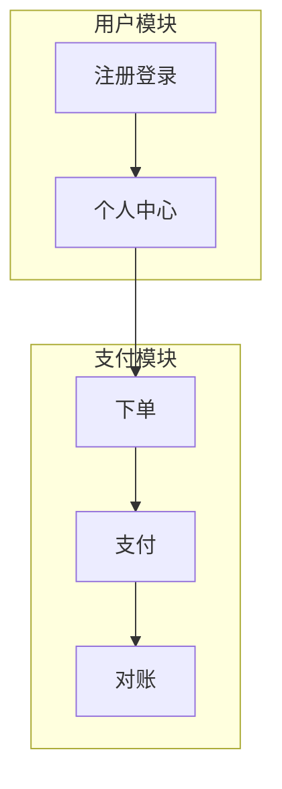
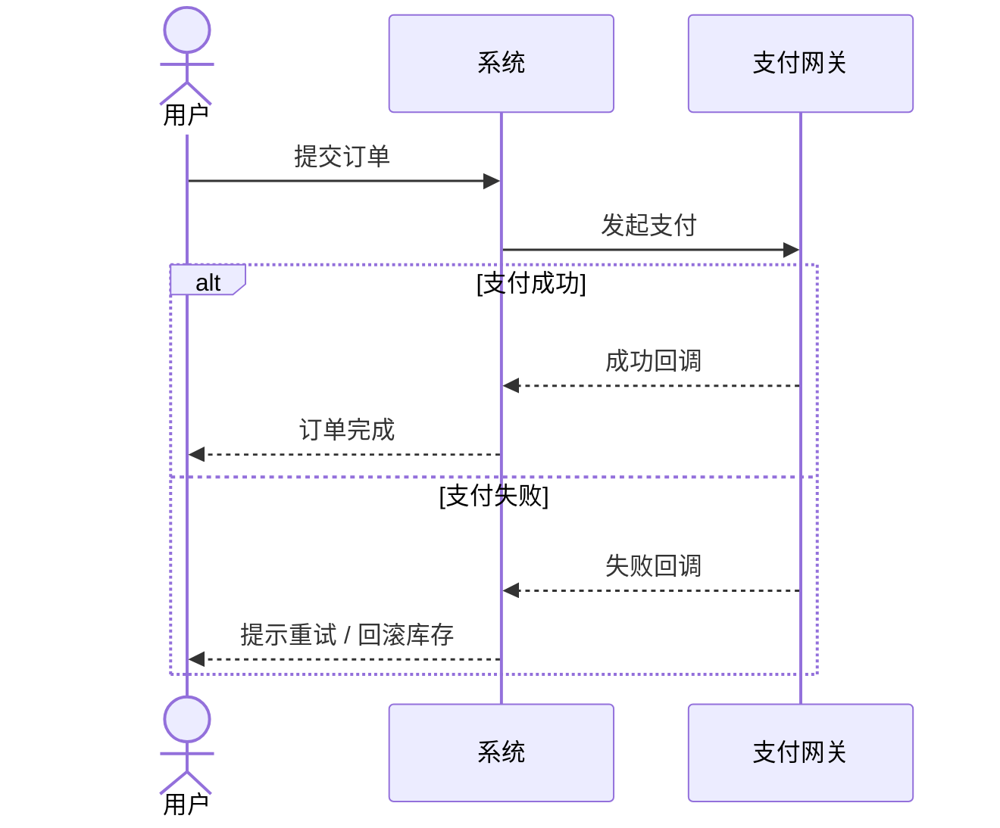
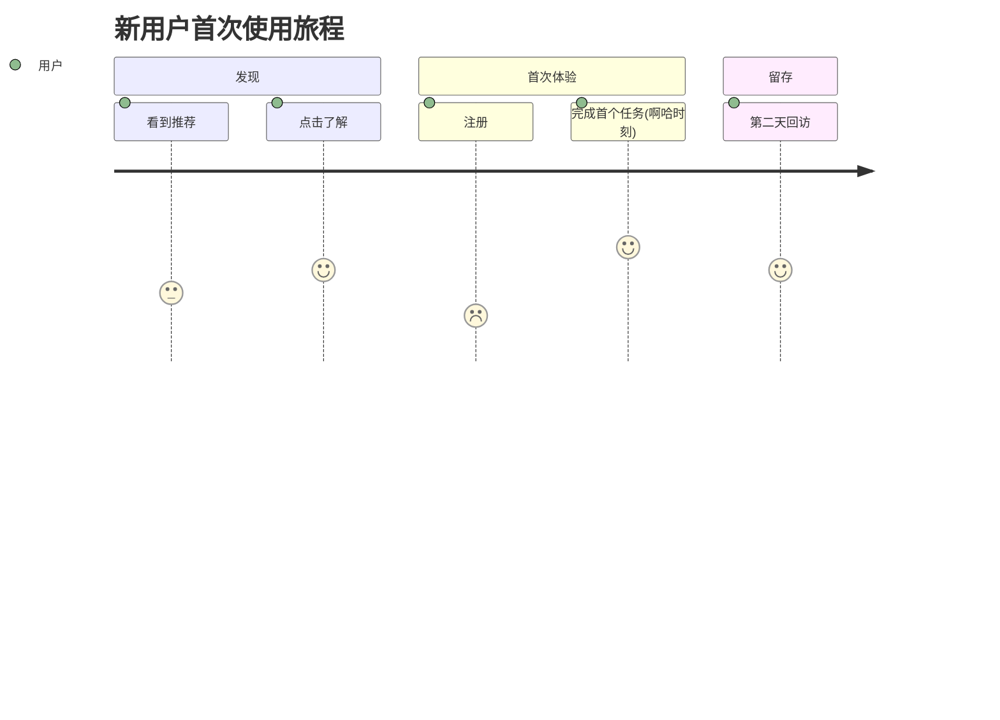

# 输出格式规范

各章节共用的格式约定。目标：每一章都具体、可扫读、对"事实 vs 假设"诚实，合并成 PRD 后读起来像一份
专业、统一的文档。

## 通用规则

- **具体胜过套话。** 能出现在任何产品文档里的句子（"提升用户体验""打造闭环"）都要换成具体、可验证的
  陈述。
- **诚实标记。** 没有真实依据的数字/断言，行内标 `[假设]`，并尽量给出自底向上的估算逻辑。引用的事实
  标来源。
- **引用而非重述。** 后面的章节用到前面已写的结论时，写"（见第 01 章 目标用户）"，不要整段复制。
- **分章文件命名固定**：`00-产品概述.md`、`01-需求分析.md`、`02-商业画布.md`、`03-用户旅程.md`、
  `04-业务流程.md`、`05-功能设计.md`。续写文件加 `.partN`（见 SKILL.md「分段续写规则」）。
- **写规范的 Markdown。** 标题前后留空行、表格用标准 `| --- |` 语法、代码块用三反引号围栏。合并脚本
  会用 prettier 统一规范化（标题空行、表格对齐、去行尾空白等），你不必手抠对齐，但结构要写对。

## 功能编码体系（第 05 章用）

四级编码：

- **L1 模块**：2–3 个大写字母（如 `USR`、`PAY`），唯一，体现核心能力。
- **L2 功能组**：两位数字 `01–99`，相关功能按业务逻辑分组。
- **L3 功能点**：两位数字 `01–99`，一个完整独立的功能单元。
- **L4 子功能**：两位数字 `01–99`，最小单位，写成**用户故事**。

完整 ID 示例：`PAY-02-03-01`。

L4 用户故事格式：

```
作为 [角色]
我想要 [功能]
以便于 [价值]
```

每条 L4 必须具体、能交付用户价值、可独立验收。

**优先级：** P0 必须（核心价值/基础支撑/稳定性）· P1 应该（重要功能/体验提升/竞争对齐）·
P2 可选（差异化/打磨/分析）· P3 择机（创新/长期/锦上添花）。

**工作量：** XXS 1–2 人天 · XS 3–5 人天 · S 1–2 人周 · M 2–4 人周 · L 1–2 月 · XL 2–3 月 · XXL 3 月+。

**技术复杂度：** Low 成熟常规 · Medium 有未知需调研 · High 难需攻关 · Very High 创新有风险。
（这只是给产品和技术负责人对齐排期用的粗略标注，凭经验判断即可，不要求写具体技术方案。）

功能清单表格格式（按 L1/L2 标题分组）：

```markdown
| ID | Title | 分级 | 优先级 | 描述 | 迭代规划 | 预估工作量 | 技术复杂度 |
|---|---|---|---|---|---|---|---|
| PAY-02-03-01 | 微信支付 | L4 | P0 | 作为付费用户，我想要用微信支付，以便于快速完成购买 | MVP | S | Medium |
```

## 图表（Mermaid）

优先用 Mermaid（多数查看器可渲染，git diff 干净）。**不要画 SVG。**

### 功能架构图（第 05 章）



### 业务流程图（第 04 章）—— 时序图，必含异常路径



也可用 `subgraph` 按角色/系统分泳道。区分节点用形状（圆角矩形=开始结束，矩形=处理，菱形=判断），
不要依赖未定义的颜色变量。

### 用户旅程图（第 03 章）



在旅程上标注**啊哈时刻**和情绪低点——那是设计优先项。

## 精益画布（第 02 章）—— 用表格，不画 SVG

九块：问题 · 客户群体 · 独特价值主张 · 不公平优势 · 客户群体 · 关键指标 · 渠道 · 成本结构 · 收入来源。
每格几个锋利要点，未验证的标 `[假设]`。

```markdown
| 问题 | 解决方案 | 独特价值主张 | 不公平优势 | 客户群体 |
|---|---|---|---|---|
| [核心问题] | [核心功能] | [一句话价值] | [最难抄的] | [目标用户] |
| **关键指标** | | **渠道** | | |
| [北极星等] | | [获客渠道] | | |
| **成本结构** | | **收入来源** | | |
| [主要成本] | | [收入模式] | | |
```
